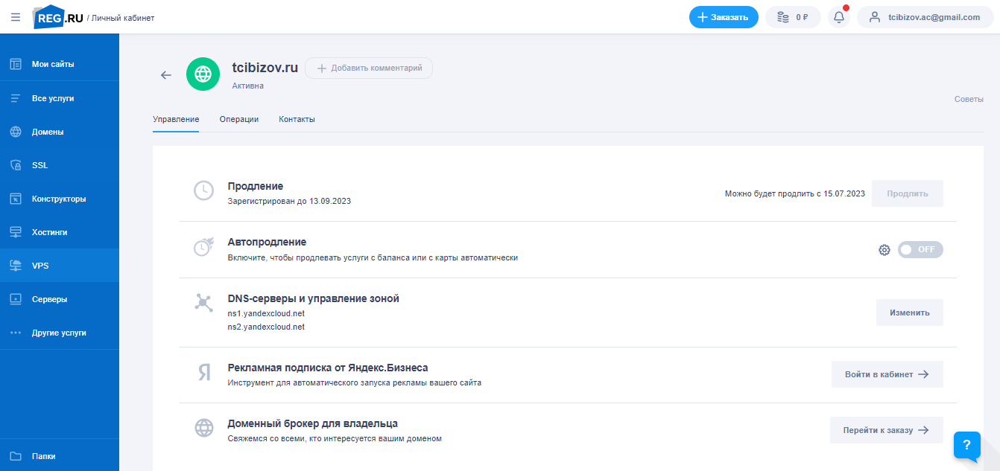
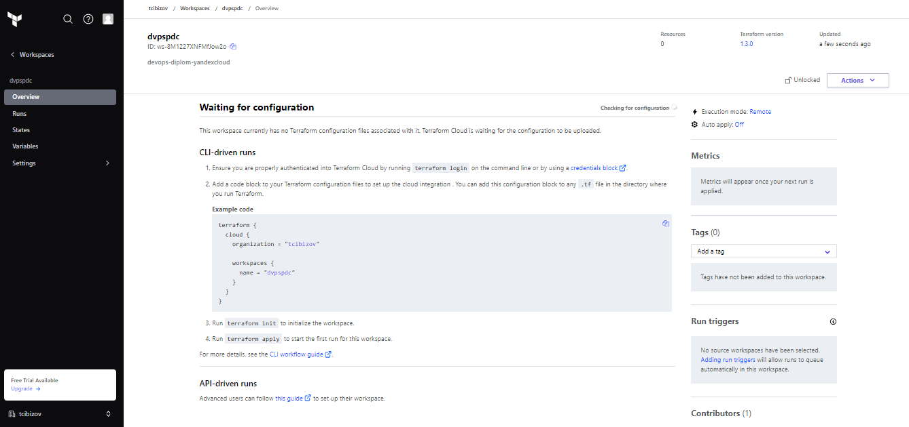

# Дипломный практикум в YandexCloud

## Подготовка к работе

1. Создаём домен `tcibizov.ru` на (https://www.reg.ru/). Прописываем DNS-серверы: (`ns1.yandexcloud.net`, `ns2.yandexcloud.net`).



2. Создадим новый workspace `devops-diplom-yandexcloud` в Terraform Cloud.



## Terraform
Подготовим инфраструктуру в Yandex Cloud при помощи Terraform.

1. В `provider.tf` добавим конфигурацию провайдера `yandex`:

```terraform
terraform {
  required_providers {
    yandex = {
      source = "yandex-cloud/yandex"
    }
  }
  required_version = ">= 0.13"
}

provider "yandex" {
  token     = "AQAAAAA-eODYAATuwQfQsl6BcUb1rMFT7Bqmw0Y"
  cloud_id  = "b1gsin4cial4tfskfcu9"
  folder_id = "b1gbmv9vnj1ko7uqevp7"
  zone      = "ru-central1-b"
}
```
2. В `main.tf`пропишем конфигурацию:
```
resource "yandex_compute_instance" "nat_instance" {
  name     = "nat"
  hostname = "nat.tcibizov.ru"
  zone     = "ru-central1-a"

  resources {
    cores  = 2
    memory = 2
  }

  boot_disk {
    initialize_params {
      image_id = "fd85e63v406oaqdjnc4b"
    }
  }

  network_interface {
    subnet_id = "e9b7ltjppp3nrkuemo66"
    nat       = true
  }

  metadata = {
    test     = "test_str"
    ssh-keys = "centos:${file("~/.ssh/id_rsa.pub")}"
  }
}

resource "yandex_compute_instance" "entrance_instance" {
  name = "main"
  zone = "ru-central1-a"

  resources {
    cores  = 2
    memory = 2
  }

  boot_disk {
    initialize_params {
      image_id = "fd85e63v406oaqdjnc4b"
      size     = 10
    }
  }

  network_interface {
    subnet_id = "e9b7ltjppp3nrkuemo66"
    nat       = true
  }

  metadata = {
    ssh-keys = "centos:${file("~/.ssh/id_rsa.pub")}"
  }
}

resource "yandex_compute_instance" "db01_instance" {
  name = "mysql-master"
  zone = "ru-central1-a"

  resources {
    cores  = 4
    memory = 4
  }

  boot_disk {
    initialize_params {
      image_id = "fd85e63v406oaqdjnc4b"
      size     = 10
    }
  }

  network_interface {
    subnet_id = "e9b7ltjppp3nrkuemo66"
  }

  metadata = {
    ssh-keys = "centos:${file("~/.ssh/id_rsa.pub")}"
  }
}

resource "yandex_compute_instance" "db02_instance" {
  name = "mysql-slave"
  zone = "ru-central1-a"

  resources {
    cores  = 4
    memory = 4
  }

  boot_disk {
    initialize_params {
      image_id = "fd85e63v406oaqdjnc4b"
      size     = 10
    }
  }

  network_interface {
    subnet_id = "e9b7ltjppp3nrkuemo66"
  }

  metadata = {
    ssh-keys = "centos:${file("~/.ssh/id_rsa.pub")}"
  }
}

resource "yandex_compute_instance" "app_instance" {
  name = "wordpress"
  zone = "ru-central1-a"

  resources {
    cores  = 4
    memory = 4
  }

  boot_disk {
    initialize_params {
      image_id = "fd85e63v406oaqdjnc4b"
      size     = 10
    }
  }

  network_interface {
    subnet_id = "e9b7ltjppp3nrkuemo66"
  }

  metadata = {
    ssh-keys = "centos:${file("~/.ssh/id_rsa.pub")}"
  }
}

resource "yandex_compute_instance" "monitoring_instance" {
  name = "monitoring"
  zone = "ru-central1-a"

  resources {
    cores  = 4
    memory = 4
  }

  boot_disk {
    initialize_params {
      image_id = "fd85e63v406oaqdjnc4b"
      size     = 10
    }
  }

  network_interface {
    subnet_id = "e9b7ltjppp3nrkuemo66"
  }

  metadata = {
    ssh-keys = "centos:${file("~/.ssh/id_rsa.pub")}"
  }
}

resource "yandex_compute_instance" "gitlab_instance" {
  name = "gitlab"
  zone = "ru-central1-a"

  resources {
    cores  = 8
    memory = 8
  }

  boot_disk {
    initialize_params {
      image_id = "fd85e63v406oaqdjnc4b"
      size     = 30
    }
  }

  network_interface {
    subnet_id = "e9b7ltjppp3nrkuemo66"
  }

  metadata = {
    ssh-keys = "centos:${file("~/.ssh/id_rsa.pub")}"
  }
}

resource "yandex_compute_instance" "runner_instance" {
  name = "runner"
  zone = "ru-central1-a"

  resources {
    cores  = 4
    memory = 4
  }

  boot_disk {
    initialize_params {
      image_id = "fd85e63v406oaqdjnc4b"
      size     = 30
    }
  }

  network_interface {
    subnet_id = "e9b7ltjppp3nrkuemo66"
  }

  metadata = {
    ssh-keys = "centos:${file("~/.ssh/id_rsa.pub")}"
  }
}
```

### Запуск Terraform

1. Выполним `terraform login`:
```
Retrieved token for user tcibizov


---------------------------------------------------------------------------------

                                          -                                
                                          -----                           -
                                          ---------                      --
                                          ---------  -                -----
                                           ---------  ------        -------
                                             -------  ---------  ----------
                                                ----  ---------- ----------
                                                  --  ---------- ----------
   Welcome to Terraform Cloud!                     -  ---------- -------
                                                      ---  ----- ---
   Documentation: terraform.io/docs/cloud             --------   -
                                                      ----------
                                                      ----------
                                                       ---------
                                                           -----
                                                               -


   New to TFC? Follow these steps to instantly apply an example configuration:

   $ git clone https://github.com/hashicorp/tfc-getting-started.git
   $ cd tfc-getting-started
   $ scripts/setup.sh

```

2. Выполним `terraform init`:
```
Initializing Terraform Cloud...

Initializing provider plugins...
- Reusing previous version of yandex-cloud/yandex from the dependency lock file
- Using previously-installed yandex-cloud/yandex v0.80.0

Terraform Cloud has been successfully initialized!

You may now begin working with Terraform Cloud. Try running "terraform plan" to
see any changes that are required for your infrastructure.

If you ever set or change modules or Terraform Settings, run "terraform init"
again to reinitialize your working directory.
```
3. Выполним `terraform validate`:
```
Initializing Terraform Cloud...

Initializing provider plugins...
- Reusing previous version of yandex-cloud/yandex from the dependency lock file
- Using previously-installed yandex-cloud/yandex v0.80.0

Terraform Cloud has been successfully initialized!

You may now begin working with Terraform Cloud. Try running "terraform plan" to
see any changes that are required for your infrastructure.

If you ever set or change modules or Terraform Settings, run "terraform init"
again to reinitialize your working directory.
root@alex:/home/alex/dvpspdc# terraform validate
Success! The configuration is valid.
```
4. Выполним `terraform plan`:
```
root@alex:/home/alex/dvpspdc# terraform plan
Running plan in Terraform Cloud. Output will stream here. Pressing Ctrl-C
will stop streaming the logs, but will not stop the plan running remotely.

Preparing the remote plan...

To view this run in a browser, visit:
https://app.terraform.io/app/tcibizov/dvpspdc/runs/run-SQy2iFkA5BjGQTFm

Waiting for the plan to start...

Terraform v1.3.0
on linux_amd64
Initializing plugins and modules...

Terraform used the selected providers to generate the following execution
plan. Resource actions are indicated with the following symbols:
  + create

Terraform will perform the following actions:

  # yandex_compute_instance.app_instance will be created
  + resource "yandex_compute_instance" "app_instance" {
      + created_at                = (known after apply)
      + folder_id                 = (known after apply)
      + fqdn                      = (known after apply)
      + hostname                  = (known after apply)
      + id                        = (known after apply)
      + metadata                  = {
          + "ssh-keys" = <<-EOT
                centos:ssh-rsa AAAAB3NzaC1yc2EAAAADAQABAAABAQDAMn6UfaB8p5V2OyPL2nJapIeRar3OGHGwejsAnscFytLX+cT/deFQ8Sg59Wm6wFc3gwPa4LzDgj5nTQgHKdcc2tuW33xF2w2oZfOuI7x3rgDTO+0nIyr7ydNhpsoSx0VsZ2PTtrn5lhB/J0qBcoX4GghMxJuE0DiglSzTC3i6QpqMT+wkdOqrMk0bVmNyQrLBrSFdQfSxNa28fTyk1TQ+m1nD3iGFDpH74kzYG8bcxFfjIVojz1OQJaQov4Jc68i5m9Kvw1OE0lb0JnmS8KTHHBhOCh8sztansh0QUcD3bidI+oAABpc+rgIhioNnYyL8GsW8zrofb0rKb+pIY+ax alex@alex
            EOT
        }
      + name                      = "wordpress"
      + network_acceleration_type = "standard"
      + platform_id               = "standard-v1"
      + service_account_id        = (known after apply)
      + status                    = (known after apply)
      + zone                      = "ru-central1-a"

      + boot_disk {
          + auto_delete = true
          + device_name = (known after apply)
          + disk_id     = (known after apply)
          + mode        = (known after apply)

          + initialize_params {
              + block_size  = (known after apply)
              + description = (known after apply)
              + image_id    = "fd85e63v406oaqdjnc4b"
              + name        = (known after apply)
              + size        = 10
              + snapshot_id = (known after apply)
              + type        = "network-hdd"
            }
        }

      + network_interface {
          + index              = (known after apply)
          + ip_address         = (known after apply)
          + ipv4               = true
          + ipv6               = (known after apply)
          + ipv6_address       = (known after apply)
          + mac_address        = (known after apply)
          + nat                = (known after apply)
          + nat_ip_address     = (known after apply)
          + nat_ip_version     = (known after apply)
          + security_group_ids = (known after apply)
          + subnet_id          = "e9b7ltjppp3nrkuemo66"
        }

      + placement_policy {
          + host_affinity_rules = (known after apply)
          + placement_group_id  = (known after apply)
        }

      + resources {
          + core_fraction = 100
          + cores         = 4
          + memory        = 4
        }

      + scheduling_policy {
          + preemptible = (known after apply)
        }
    }

  # yandex_compute_instance.db01_instance will be created
  + resource "yandex_compute_instance" "db01_instance" {
      + created_at                = (known after apply)
      + folder_id                 = (known after apply)
      + fqdn                      = (known after apply)
      + hostname                  = (known after apply)
      + id                        = (known after apply)
      + metadata                  = {
          + "ssh-keys" = <<-EOT
                centos:ssh-rsa AAAAB3NzaC1yc2EAAAADAQABAAABAQDAMn6UfaB8p5V2OyPL2nJapIeRar3OGHGwejsAnscFytLX+cT/deFQ8Sg59Wm6wFc3gwPa4LzDgj5nTQgHKdcc2tuW33xF2w2oZfOuI7x3rgDTO+0nIyr7ydNhpsoSx0VsZ2PTtrn5lhB/J0qBcoX4GghMxJuE0DiglSzTC3i6QpqMT+wkdOqrMk0bVmNyQrLBrSFdQfSxNa28fTyk1TQ+m1nD3iGFDpH74kzYG8bcxFfjIVojz1OQJaQov4Jc68i5m9Kvw1OE0lb0JnmS8KTHHBhOCh8sztansh0QUcD3bidI+oAABpc+rgIhioNnYyL8GsW8zrofb0rKb+pIY+ax alex@alex
            EOT
        }
      + name                      = "mysql-master"
      + network_acceleration_type = "standard"
      + platform_id               = "standard-v1"
      + service_account_id        = (known after apply)
      + status                    = (known after apply)
      + zone                      = "ru-central1-a"

      + boot_disk {
          + auto_delete = true
          + device_name = (known after apply)
          + disk_id     = (known after apply)
          + mode        = (known after apply)

          + initialize_params {
              + block_size  = (known after apply)
              + description = (known after apply)
              + image_id    = "fd85e63v406oaqdjnc4b"
              + name        = (known after apply)
              + size        = 10
              + snapshot_id = (known after apply)
              + type        = "network-hdd"
            }
        }

      + network_interface {
          + index              = (known after apply)
          + ip_address         = (known after apply)
          + ipv4               = true
          + ipv6               = (known after apply)
          + ipv6_address       = (known after apply)
          + mac_address        = (known after apply)
          + nat                = (known after apply)
          + nat_ip_address     = (known after apply)
          + nat_ip_version     = (known after apply)
          + security_group_ids = (known after apply)
          + subnet_id          = "e9b7ltjppp3nrkuemo66"
        }

      + placement_policy {
          + host_affinity_rules = (known after apply)
          + placement_group_id  = (known after apply)
        }

      + resources {
          + core_fraction = 100
          + cores         = 4
          + memory        = 4
        }

      + scheduling_policy {
          + preemptible = (known after apply)
        }
    }

  # yandex_compute_instance.db02_instance will be created
  + resource "yandex_compute_instance" "db02_instance" {
      + created_at                = (known after apply)
      + folder_id                 = (known after apply)
      + fqdn                      = (known after apply)
      + hostname                  = (known after apply)
      + id                        = (known after apply)
      + metadata                  = {
          + "ssh-keys" = <<-EOT
                centos:ssh-rsa AAAAB3NzaC1yc2EAAAADAQABAAABAQDAMn6UfaB8p5V2OyPL2nJapIeRar3OGHGwejsAnscFytLX+cT/deFQ8Sg59Wm6wFc3gwPa4LzDgj5nTQgHKdcc2tuW33xF2w2oZfOuI7x3rgDTO+0nIyr7ydNhpsoSx0VsZ2PTtrn5lhB/J0qBcoX4GghMxJuE0DiglSzTC3i6QpqMT+wkdOqrMk0bVmNyQrLBrSFdQfSxNa28fTyk1TQ+m1nD3iGFDpH74kzYG8bcxFfjIVojz1OQJaQov4Jc68i5m9Kvw1OE0lb0JnmS8KTHHBhOCh8sztansh0QUcD3bidI+oAABpc+rgIhioNnYyL8GsW8zrofb0rKb+pIY+ax alex@alex
            EOT
        }
      + name                      = "mysql-slave"
      + network_acceleration_type = "standard"
      + platform_id               = "standard-v1"
      + service_account_id        = (known after apply)
      + status                    = (known after apply)
      + zone                      = "ru-central1-a"

      + boot_disk {
          + auto_delete = true
          + device_name = (known after apply)
          + disk_id     = (known after apply)
          + mode        = (known after apply)

          + initialize_params {
              + block_size  = (known after apply)
              + description = (known after apply)
              + image_id    = "fd85e63v406oaqdjnc4b"
              + name        = (known after apply)
              + size        = 10
              + snapshot_id = (known after apply)
              + type        = "network-hdd"
            }
        }

      + network_interface {
          + index              = (known after apply)
          + ip_address         = (known after apply)
          + ipv4               = true
          + ipv6               = (known after apply)
          + ipv6_address       = (known after apply)
          + mac_address        = (known after apply)
          + nat                = (known after apply)
          + nat_ip_address     = (known after apply)
          + nat_ip_version     = (known after apply)
          + security_group_ids = (known after apply)
          + subnet_id          = "e9b7ltjppp3nrkuemo66"
        }

      + placement_policy {
          + host_affinity_rules = (known after apply)
          + placement_group_id  = (known after apply)
        }

      + resources {
          + core_fraction = 100
          + cores         = 4
          + memory        = 4
        }

      + scheduling_policy {
          + preemptible = (known after apply)
        }
    }

  # yandex_compute_instance.entrance_instance will be created
  + resource "yandex_compute_instance" "entrance_instance" {
      + created_at                = (known after apply)
      + folder_id                 = (known after apply)
      + fqdn                      = (known after apply)
      + hostname                  = (known after apply)
      + id                        = (known after apply)
      + metadata                  = {
          + "ssh-keys" = <<-EOT
                centos:ssh-rsa AAAAB3NzaC1yc2EAAAADAQABAAABAQDAMn6UfaB8p5V2OyPL2nJapIeRar3OGHGwejsAnscFytLX+cT/deFQ8Sg59Wm6wFc3gwPa4LzDgj5nTQgHKdcc2tuW33xF2w2oZfOuI7x3rgDTO+0nIyr7ydNhpsoSx0VsZ2PTtrn5lhB/J0qBcoX4GghMxJuE0DiglSzTC3i6QpqMT+wkdOqrMk0bVmNyQrLBrSFdQfSxNa28fTyk1TQ+m1nD3iGFDpH74kzYG8bcxFfjIVojz1OQJaQov4Jc68i5m9Kvw1OE0lb0JnmS8KTHHBhOCh8sztansh0QUcD3bidI+oAABpc+rgIhioNnYyL8GsW8zrofb0rKb+pIY+ax alex@alex
            EOT
        }
      + name                      = "main"
      + network_acceleration_type = "standard"
      + platform_id               = "standard-v1"
      + service_account_id        = (known after apply)
      + status                    = (known after apply)
      + zone                      = "ru-central1-a"

      + boot_disk {
          + auto_delete = true
          + device_name = (known after apply)
          + disk_id     = (known after apply)
          + mode        = (known after apply)

          + initialize_params {
              + block_size  = (known after apply)
              + description = (known after apply)
              + image_id    = "fd85e63v406oaqdjnc4b"
              + name        = (known after apply)
              + size        = 10
              + snapshot_id = (known after apply)
              + type        = "network-hdd"
            }
        }

      + network_interface {
          + index              = (known after apply)
          + ip_address         = (known after apply)
          + ipv4               = true
          + ipv6               = (known after apply)
          + ipv6_address       = (known after apply)
          + mac_address        = (known after apply)
          + nat                = true
          + nat_ip_address     = (known after apply)
          + nat_ip_version     = (known after apply)
          + security_group_ids = (known after apply)
          + subnet_id          = "e9b7ltjppp3nrkuemo66"
        }

      + placement_policy {
          + host_affinity_rules = (known after apply)
          + placement_group_id  = (known after apply)
        }

      + resources {
          + core_fraction = 100
          + cores         = 2
          + memory        = 2
        }

      + scheduling_policy {
          + preemptible = (known after apply)
        }
    }

  # yandex_compute_instance.gitlab_instance will be created
  + resource "yandex_compute_instance" "gitlab_instance" {
      + created_at                = (known after apply)
      + folder_id                 = (known after apply)
      + fqdn                      = (known after apply)
      + hostname                  = (known after apply)
      + id                        = (known after apply)
      + metadata                  = {
          + "ssh-keys" = <<-EOT
                centos:ssh-rsa AAAAB3NzaC1yc2EAAAADAQABAAABAQDAMn6UfaB8p5V2OyPL2nJapIeRar3OGHGwejsAnscFytLX+cT/deFQ8Sg59Wm6wFc3gwPa4LzDgj5nTQgHKdcc2tuW33xF2w2oZfOuI7x3rgDTO+0nIyr7ydNhpsoSx0VsZ2PTtrn5lhB/J0qBcoX4GghMxJuE0DiglSzTC3i6QpqMT+wkdOqrMk0bVmNyQrLBrSFdQfSxNa28fTyk1TQ+m1nD3iGFDpH74kzYG8bcxFfjIVojz1OQJaQov4Jc68i5m9Kvw1OE0lb0JnmS8KTHHBhOCh8sztansh0QUcD3bidI+oAABpc+rgIhioNnYyL8GsW8zrofb0rKb+pIY+ax alex@alex
            EOT
        }
      + name                      = "gitlab"
      + network_acceleration_type = "standard"
      + platform_id               = "standard-v1"
      + service_account_id        = (known after apply)
      + status                    = (known after apply)
      + zone                      = "ru-central1-a"

      + boot_disk {
          + auto_delete = true
          + device_name = (known after apply)
          + disk_id     = (known after apply)
          + mode        = (known after apply)

          + initialize_params {
              + block_size  = (known after apply)
              + description = (known after apply)
              + image_id    = "fd85e63v406oaqdjnc4b"
              + name        = (known after apply)
              + size        = 30
              + snapshot_id = (known after apply)
              + type        = "network-hdd"
            }
        }

      + network_interface {
          + index              = (known after apply)
          + ip_address         = (known after apply)
          + ipv4               = true
          + ipv6               = (known after apply)
          + ipv6_address       = (known after apply)
          + mac_address        = (known after apply)
          + nat                = (known after apply)
          + nat_ip_address     = (known after apply)
          + nat_ip_version     = (known after apply)
          + security_group_ids = (known after apply)
          + subnet_id          = "e9b7ltjppp3nrkuemo66"
        }

      + placement_policy {
          + host_affinity_rules = (known after apply)
          + placement_group_id  = (known after apply)
        }

      + resources {
          + core_fraction = 100
          + cores         = 8
          + memory        = 8
        }

      + scheduling_policy {
          + preemptible = (known after apply)
        }
    }

  # yandex_compute_instance.monitoring_instance will be created
  + resource "yandex_compute_instance" "monitoring_instance" {
      + created_at                = (known after apply)
      + folder_id                 = (known after apply)
      + fqdn                      = (known after apply)
      + hostname                  = (known after apply)
      + id                        = (known after apply)
      + metadata                  = {
          + "ssh-keys" = <<-EOT
                centos:ssh-rsa AAAAB3NzaC1yc2EAAAADAQABAAABAQDAMn6UfaB8p5V2OyPL2nJapIeRar3OGHGwejsAnscFytLX+cT/deFQ8Sg59Wm6wFc3gwPa4LzDgj5nTQgHKdcc2tuW33xF2w2oZfOuI7x3rgDTO+0nIyr7ydNhpsoSx0VsZ2PTtrn5lhB/J0qBcoX4GghMxJuE0DiglSzTC3i6QpqMT+wkdOqrMk0bVmNyQrLBrSFdQfSxNa28fTyk1TQ+m1nD3iGFDpH74kzYG8bcxFfjIVojz1OQJaQov4Jc68i5m9Kvw1OE0lb0JnmS8KTHHBhOCh8sztansh0QUcD3bidI+oAABpc+rgIhioNnYyL8GsW8zrofb0rKb+pIY+ax alex@alex
            EOT
        }
      + name                      = "monitoring"
      + network_acceleration_type = "standard"
      + platform_id               = "standard-v1"
      + service_account_id        = (known after apply)
      + status                    = (known after apply)
      + zone                      = "ru-central1-a"

      + boot_disk {
          + auto_delete = true
          + device_name = (known after apply)
          + disk_id     = (known after apply)
          + mode        = (known after apply)

          + initialize_params {
              + block_size  = (known after apply)
              + description = (known after apply)
              + image_id    = "fd85e63v406oaqdjnc4b"
              + name        = (known after apply)
              + size        = 10
              + snapshot_id = (known after apply)
              + type        = "network-hdd"
            }
        }

      + network_interface {
          + index              = (known after apply)
          + ip_address         = (known after apply)
          + ipv4               = true
          + ipv6               = (known after apply)
          + ipv6_address       = (known after apply)
          + mac_address        = (known after apply)
          + nat                = (known after apply)
          + nat_ip_address     = (known after apply)
          + nat_ip_version     = (known after apply)
          + security_group_ids = (known after apply)
          + subnet_id          = "e9b7ltjppp3nrkuemo66"
        }

      + placement_policy {
          + host_affinity_rules = (known after apply)
          + placement_group_id  = (known after apply)
        }

      + resources {
          + core_fraction = 100
          + cores         = 4
          + memory        = 4
        }

      + scheduling_policy {
          + preemptible = (known after apply)
        }
    }

  # yandex_compute_instance.nat_instance will be created
  + resource "yandex_compute_instance" "nat_instance" {
      + created_at                = (known after apply)
      + folder_id                 = (known after apply)
      + fqdn                      = (known after apply)
      + hostname                  = "nat.tcibizov.ru"
      + id                        = (known after apply)
      + metadata                  = {
          + "ssh-keys" = <<-EOT
                centos:ssh-rsa AAAAB3NzaC1yc2EAAAADAQABAAABAQDAMn6UfaB8p5V2OyPL2nJapIeRar3OGHGwejsAnscFytLX+cT/deFQ8Sg59Wm6wFc3gwPa4LzDgj5nTQgHKdcc2tuW33xF2w2oZfOuI7x3rgDTO+0nIyr7ydNhpsoSx0VsZ2PTtrn5lhB/J0qBcoX4GghMxJuE0DiglSzTC3i6QpqMT+wkdOqrMk0bVmNyQrLBrSFdQfSxNa28fTyk1TQ+m1nD3iGFDpH74kzYG8bcxFfjIVojz1OQJaQov4Jc68i5m9Kvw1OE0lb0JnmS8KTHHBhOCh8sztansh0QUcD3bidI+oAABpc+rgIhioNnYyL8GsW8zrofb0rKb+pIY+ax alex@alex
            EOT
          + "test"     = "test_str"
        }
      + name                      = "nat"
      + network_acceleration_type = "standard"
      + platform_id               = "standard-v1"
      + service_account_id        = (known after apply)
      + status                    = (known after apply)
      + zone                      = "ru-central1-a"

      + boot_disk {
          + auto_delete = true
          + device_name = (known after apply)
          + disk_id     = (known after apply)
          + mode        = (known after apply)

          + initialize_params {
              + block_size  = (known after apply)
              + description = (known after apply)
              + image_id    = "fd85e63v406oaqdjnc4b"
              + name        = (known after apply)
              + size        = (known after apply)
              + snapshot_id = (known after apply)
              + type        = "network-hdd"
            }
        }

      + network_interface {
          + index              = (known after apply)
          + ip_address         = (known after apply)
          + ipv4               = true
          + ipv6               = (known after apply)
          + ipv6_address       = (known after apply)
          + mac_address        = (known after apply)
          + nat                = true
          + nat_ip_address     = (known after apply)
          + nat_ip_version     = (known after apply)
          + security_group_ids = (known after apply)
          + subnet_id          = "e9b7ltjppp3nrkuemo66"
        }

      + placement_policy {
          + host_affinity_rules = (known after apply)
          + placement_group_id  = (known after apply)
        }

      + resources {
          + core_fraction = 100
          + cores         = 2
          + memory        = 2
        }

      + scheduling_policy {
          + preemptible = (known after apply)
        }
    }

  # yandex_compute_instance.runner_instance will be created
  + resource "yandex_compute_instance" "runner_instance" {
      + created_at                = (known after apply)
      + folder_id                 = (known after apply)
      + fqdn                      = (known after apply)
      + hostname                  = (known after apply)
      + id                        = (known after apply)
      + metadata                  = {
          + "ssh-keys" = <<-EOT
                centos:ssh-rsa AAAAB3NzaC1yc2EAAAADAQABAAABAQDAMn6UfaB8p5V2OyPL2nJapIeRar3OGHGwejsAnscFytLX+cT/deFQ8Sg59Wm6wFc3gwPa4LzDgj5nTQgHKdcc2tuW33xF2w2oZfOuI7x3rgDTO+0nIyr7ydNhpsoSx0VsZ2PTtrn5lhB/J0qBcoX4GghMxJuE0DiglSzTC3i6QpqMT+wkdOqrMk0bVmNyQrLBrSFdQfSxNa28fTyk1TQ+m1nD3iGFDpH74kzYG8bcxFfjIVojz1OQJaQov4Jc68i5m9Kvw1OE0lb0JnmS8KTHHBhOCh8sztansh0QUcD3bidI+oAABpc+rgIhioNnYyL8GsW8zrofb0rKb+pIY+ax alex@alex
            EOT
        }
      + name                      = "runner"
      + network_acceleration_type = "standard"
      + platform_id               = "standard-v1"
      + service_account_id        = (known after apply)
      + status                    = (known after apply)
      + zone                      = "ru-central1-a"

      + boot_disk {
          + auto_delete = true
          + device_name = (known after apply)
          + disk_id     = (known after apply)
          + mode        = (known after apply)

          + initialize_params {
              + block_size  = (known after apply)
              + description = (known after apply)
              + image_id    = "fd85e63v406oaqdjnc4b"
              + name        = (known after apply)
              + size        = 30
              + snapshot_id = (known after apply)
              + type        = "network-hdd"
            }
        }

      + network_interface {
          + index              = (known after apply)
          + ip_address         = (known after apply)
          + ipv4               = true
          + ipv6               = (known after apply)
          + ipv6_address       = (known after apply)
          + mac_address        = (known after apply)
          + nat                = (known after apply)
          + nat_ip_address     = (known after apply)
          + nat_ip_version     = (known after apply)
          + security_group_ids = (known after apply)
          + subnet_id          = "e9b7ltjppp3nrkuemo66"
        }

      + placement_policy {
          + host_affinity_rules = (known after apply)
          + placement_group_id  = (known after apply)
        }

      + resources {
          + core_fraction = 100
          + cores         = 4
          + memory        = 4
        }

      + scheduling_policy {
          + preemptible = (known after apply)
        }
    }

  # yandex_dns_recordset.alertmanager_recordset will be created
  + resource "yandex_dns_recordset" "alertmanager_recordset" {
      + data    = (known after apply)
      + id      = (known after apply)
      + name    = "alertmanager.tcibizov.ru."
      + ttl     = 600
      + type    = "A"
      + zone_id = (known after apply)
    }

  # yandex_dns_recordset.gitlab_recordset will be created
  + resource "yandex_dns_recordset" "gitlab_recordset" {
      + data    = (known after apply)
      + id      = (known after apply)
      + name    = "gitlab.tcibizov.ru."
      + ttl     = 600
      + type    = "A"
      + zone_id = (known after apply)
    }

  # yandex_dns_recordset.grafana_recordset will be created
  + resource "yandex_dns_recordset" "grafana_recordset" {
      + data    = (known after apply)
      + id      = (known after apply)
      + name    = "grafana.tcibizov.ru."
      + ttl     = 600
      + type    = "A"
      + zone_id = (known after apply)
    }

  # yandex_dns_recordset.prometheus_recordset will be created
  + resource "yandex_dns_recordset" "prometheus_recordset" {
      + data    = (known after apply)
      + id      = (known after apply)
      + name    = "prometheus.tcibizov.ru."
      + ttl     = 600
      + type    = "A"
      + zone_id = (known after apply)
    }

  # yandex_dns_recordset.www_recordset will be created
  + resource "yandex_dns_recordset" "www_recordset" {
      + data    = (known after apply)
      + id      = (known after apply)
      + name    = "www.tcibizov.ru."
      + ttl     = 600
      + type    = "A"
      + zone_id = (known after apply)
    }

  # yandex_dns_zone.dns_zone will be created
  + resource "yandex_dns_zone" "dns_zone" {
      + created_at       = (known after apply)
      + folder_id        = (known after apply)
      + id               = (known after apply)
      + name             = "public-dns-zone"
      + private_networks = (known after apply)
      + public           = true
      + zone             = "tcibizov.ru."
    }

  # yandex_vpc_network.vpc_network will be created
  + resource "yandex_vpc_network" "vpc_network" {
      + created_at                = (known after apply)
      + default_security_group_id = (known after apply)
      + folder_id                 = (known after apply)
      + id                        = (known after apply)
      + labels                    = (known after apply)
      + name                      = "vpc-network"
      + subnet_ids                = (known after apply)
    }

  # yandex_vpc_route_table.nat_vpc_route_table will be created
  + resource "yandex_vpc_route_table" "nat_vpc_route_table" {
      + created_at = (known after apply)
      + folder_id  = (known after apply)
      + id         = (known after apply)
      + labels     = (known after apply)
      + name       = "nat-route-table"
      + network_id = (known after apply)

      + static_route {
          + destination_prefix = "0.0.0.0/0"
          + next_hop_address   = (known after apply)
        }
    }

  # yandex_vpc_subnet.private_vpc_subnet will be created
  + resource "yandex_vpc_subnet" "private_vpc_subnet" {
      + created_at     = (known after apply)
      + folder_id      = (known after apply)
      + id             = (known after apply)
      + labels         = (known after apply)
      + name           = "private-vpc-subnet"
      + network_id     = (known after apply)
      + route_table_id = (known after apply)
      + v4_cidr_blocks = [
          + "10.100.1.0/24",
        ]
      + v6_cidr_blocks = (known after apply)
      + zone           = "ru-central1-a"
    }

  # yandex_vpc_subnet.public_vpc_subnet will be created
  + resource "yandex_vpc_subnet" "public_vpc_subnet" {
      + created_at     = (known after apply)
      + folder_id      = (known after apply)
      + id             = (known after apply)
      + labels         = (known after apply)
      + name           = "public-vpc-subnet"
      + network_id     = (known after apply)
      + v4_cidr_blocks = [
          + "10.100.2.0/24",
        ]
      + v6_cidr_blocks = (known after apply)
      + zone           = "ru-central1-a"
    }

Plan: 18 to add, 0 to change, 0 to destroy.

root@alex:/home/alex/dvpspdc#
```
4. Выполним `terraform applay`:
```
root@alex:/home/alex/dvpspdc# terraform apply
Running apply in Terraform Cloud. Output will stream here. Pressing Ctrl-C
will cancel the remote apply if it's still pending. If the apply started it
will stop streaming the logs, but will not stop the apply running remotely.

Preparing the remote apply...

To view this run in a browser, visit:
https://app.terraform.io/app/tcibizov/dvpspdc/runs/run-4fTfK1PuBLtGmZHS

Waiting for the plan to start...

Terraform v1.3.0
on linux_amd64
Initializing plugins and modules...

Terraform used the selected providers to generate the following execution
plan. Resource actions are indicated with the following symbols:
  + create

Terraform will perform the following actions:

  # yandex_compute_instance.app_instance will be created
  + resource "yandex_compute_instance" "app_instance" {
      + created_at                = (known after apply)
      + folder_id                 = (known after apply)
      + fqdn                      = (known after apply)
      + hostname                  = (known after apply)
      + id                        = (known after apply)
      + metadata                  = {
          + "ssh-keys" = <<-EOT
                centos:ssh-rsa AAAAB3NzaC1yc2EAAAADAQABAAABAQDAMn6UfaB8p5V2OyPL2nJapIeRar3OGHGwejsAnscFytLX+cT/deFQ8Sg59Wm6wFc3gwPa4LzDgj5nTQgHKdcc2tuW33xF2w2oZfOuI7x3rgDTO+0nIyr7ydNhpsoSx0VsZ2PTtrn5lhB/J0qBcoX4GghMxJuE0DiglSzTC3i6QpqMT+wkdOqrMk0bVmNyQrLBrSFdQfSxNa28fTyk1TQ+m1nD3iGFDpH74kzYG8bcxFfjIVojz1OQJaQov4Jc68i5m9Kvw1OE0lb0JnmS8KTHHBhOCh8sztansh0QUcD3bidI+oAABpc+rgIhioNnYyL8GsW8zrofb0rKb+pIY+ax alex@alex
            EOT
        }
      + name                      = "wordpress"
      + network_acceleration_type = "standard"
      + platform_id               = "standard-v1"
      + service_account_id        = (known after apply)
      + status                    = (known after apply)
      + zone                      = "ru-central1-a"

      + boot_disk {
          + auto_delete = true
          + device_name = (known after apply)
          + disk_id     = (known after apply)
          + mode        = (known after apply)

          + initialize_params {
              + block_size  = (known after apply)
              + description = (known after apply)
              + image_id    = "fd85e63v406oaqdjnc4b"
              + name        = (known after apply)
              + size        = 10
              + snapshot_id = (known after apply)
              + type        = "network-hdd"
            }
        }

      + network_interface {
          + index              = (known after apply)
          + ip_address         = (known after apply)
          + ipv4               = true
          + ipv6               = (known after apply)
          + ipv6_address       = (known after apply)
          + mac_address        = (known after apply)
          + nat                = (known after apply)
          + nat_ip_address     = (known after apply)
          + nat_ip_version     = (known after apply)
          + security_group_ids = (known after apply)
          + subnet_id          = "e9b7ltjppp3nrkuemo66"
        }

      + placement_policy {
          + host_affinity_rules = (known after apply)
          + placement_group_id  = (known after apply)
        }

      + resources {
          + core_fraction = 100
          + cores         = 4
          + memory        = 4
        }

      + scheduling_policy {
          + preemptible = (known after apply)
        }
    }

  # yandex_compute_instance.db01_instance will be created
  + resource "yandex_compute_instance" "db01_instance" {
      + created_at                = (known after apply)
      + folder_id                 = (known after apply)
      + fqdn                      = (known after apply)
      + hostname                  = (known after apply)
      + id                        = (known after apply)
      + metadata                  = {
          + "ssh-keys" = <<-EOT
                centos:ssh-rsa AAAAB3NzaC1yc2EAAAADAQABAAABAQDAMn6UfaB8p5V2OyPL2nJapIeRar3OGHGwejsAnscFytLX+cT/deFQ8Sg59Wm6wFc3gwPa4LzDgj5nTQgHKdcc2tuW33xF2w2oZfOuI7x3rgDTO+0nIyr7ydNhpsoSx0VsZ2PTtrn5lhB/J0qBcoX4GghMxJuE0DiglSzTC3i6QpqMT+wkdOqrMk0bVmNyQrLBrSFdQfSxNa28fTyk1TQ+m1nD3iGFDpH74kzYG8bcxFfjIVojz1OQJaQov4Jc68i5m9Kvw1OE0lb0JnmS8KTHHBhOCh8sztansh0QUcD3bidI+oAABpc+rgIhioNnYyL8GsW8zrofb0rKb+pIY+ax alex@alex
            EOT
        }
      + name                      = "mysql-master"
      + network_acceleration_type = "standard"
      + platform_id               = "standard-v1"
      + service_account_id        = (known after apply)
      + status                    = (known after apply)
      + zone                      = "ru-central1-a"

      + boot_disk {
          + auto_delete = true
          + device_name = (known after apply)
          + disk_id     = (known after apply)
          + mode        = (known after apply)

          + initialize_params {
              + block_size  = (known after apply)
              + description = (known after apply)
              + image_id    = "fd85e63v406oaqdjnc4b"
              + name        = (known after apply)
              + size        = 10
              + snapshot_id = (known after apply)
              + type        = "network-hdd"
            }
        }

      + network_interface {
          + index              = (known after apply)
          + ip_address         = (known after apply)
          + ipv4               = true
          + ipv6               = (known after apply)
          + ipv6_address       = (known after apply)
          + mac_address        = (known after apply)
          + nat                = (known after apply)
          + nat_ip_address     = (known after apply)
          + nat_ip_version     = (known after apply)
          + security_group_ids = (known after apply)
          + subnet_id          = "e9b7ltjppp3nrkuemo66"
        }

      + placement_policy {
          + host_affinity_rules = (known after apply)
          + placement_group_id  = (known after apply)
        }

      + resources {
          + core_fraction = 100
          + cores         = 4
          + memory        = 4
        }

      + scheduling_policy {
          + preemptible = (known after apply)
        }
    }

  # yandex_compute_instance.db02_instance will be created
  + resource "yandex_compute_instance" "db02_instance" {
      + created_at                = (known after apply)
      + folder_id                 = (known after apply)
      + fqdn                      = (known after apply)
      + hostname                  = (known after apply)
      + id                        = (known after apply)
      + metadata                  = {
          + "ssh-keys" = <<-EOT
                centos:ssh-rsa AAAAB3NzaC1yc2EAAAADAQABAAABAQDAMn6UfaB8p5V2OyPL2nJapIeRar3OGHGwejsAnscFytLX+cT/deFQ8Sg59Wm6wFc3gwPa4LzDgj5nTQgHKdcc2tuW33xF2w2oZfOuI7x3rgDTO+0nIyr7ydNhpsoSx0VsZ2PTtrn5lhB/J0qBcoX4GghMxJuE0DiglSzTC3i6QpqMT+wkdOqrMk0bVmNyQrLBrSFdQfSxNa28fTyk1TQ+m1nD3iGFDpH74kzYG8bcxFfjIVojz1OQJaQov4Jc68i5m9Kvw1OE0lb0JnmS8KTHHBhOCh8sztansh0QUcD3bidI+oAABpc+rgIhioNnYyL8GsW8zrofb0rKb+pIY+ax alex@alex
            EOT
        }
      + name                      = "mysql-slave"
      + network_acceleration_type = "standard"
      + platform_id               = "standard-v1"
      + service_account_id        = (known after apply)
      + status                    = (known after apply)
      + zone                      = "ru-central1-a"

      + boot_disk {
          + auto_delete = true
          + device_name = (known after apply)
          + disk_id     = (known after apply)
          + mode        = (known after apply)

          + initialize_params {
              + block_size  = (known after apply)
              + description = (known after apply)
              + image_id    = "fd85e63v406oaqdjnc4b"
              + name        = (known after apply)
              + size        = 10
              + snapshot_id = (known after apply)
              + type        = "network-hdd"
            }
        }

      + network_interface {
          + index              = (known after apply)
          + ip_address         = (known after apply)
          + ipv4               = true
          + ipv6               = (known after apply)
          + ipv6_address       = (known after apply)
          + mac_address        = (known after apply)
          + nat                = (known after apply)
          + nat_ip_address     = (known after apply)
          + nat_ip_version     = (known after apply)
          + security_group_ids = (known after apply)
          + subnet_id          = "e9b7ltjppp3nrkuemo66"
        }

      + placement_policy {
          + host_affinity_rules = (known after apply)
          + placement_group_id  = (known after apply)
        }

      + resources {
          + core_fraction = 100
          + cores         = 4
          + memory        = 4
        }

      + scheduling_policy {
          + preemptible = (known after apply)
        }
    }

  # yandex_compute_instance.entrance_instance will be created
  + resource "yandex_compute_instance" "entrance_instance" {
      + created_at                = (known after apply)
      + folder_id                 = (known after apply)
      + fqdn                      = (known after apply)
      + hostname                  = (known after apply)
      + id                        = (known after apply)
      + metadata                  = {
          + "ssh-keys" = <<-EOT
                centos:ssh-rsa AAAAB3NzaC1yc2EAAAADAQABAAABAQDAMn6UfaB8p5V2OyPL2nJapIeRar3OGHGwejsAnscFytLX+cT/deFQ8Sg59Wm6wFc3gwPa4LzDgj5nTQgHKdcc2tuW33xF2w2oZfOuI7x3rgDTO+0nIyr7ydNhpsoSx0VsZ2PTtrn5lhB/J0qBcoX4GghMxJuE0DiglSzTC3i6QpqMT+wkdOqrMk0bVmNyQrLBrSFdQfSxNa28fTyk1TQ+m1nD3iGFDpH74kzYG8bcxFfjIVojz1OQJaQov4Jc68i5m9Kvw1OE0lb0JnmS8KTHHBhOCh8sztansh0QUcD3bidI+oAABpc+rgIhioNnYyL8GsW8zrofb0rKb+pIY+ax alex@alex
            EOT
        }
      + name                      = "main"
      + network_acceleration_type = "standard"
      + platform_id               = "standard-v1"
      + service_account_id        = (known after apply)
      + status                    = (known after apply)
      + zone                      = "ru-central1-a"

      + boot_disk {
          + auto_delete = true
          + device_name = (known after apply)
          + disk_id     = (known after apply)
          + mode        = (known after apply)

          + initialize_params {
              + block_size  = (known after apply)
              + description = (known after apply)
              + image_id    = "fd85e63v406oaqdjnc4b"
              + name        = (known after apply)
              + size        = 10
              + snapshot_id = (known after apply)
              + type        = "network-hdd"
            }
        }

      + network_interface {
          + index              = (known after apply)
          + ip_address         = (known after apply)
          + ipv4               = true
          + ipv6               = (known after apply)
          + ipv6_address       = (known after apply)
          + mac_address        = (known after apply)
          + nat                = true
          + nat_ip_address     = (known after apply)
          + nat_ip_version     = (known after apply)
          + security_group_ids = (known after apply)
          + subnet_id          = "e9b7ltjppp3nrkuemo66"
        }

      + placement_policy {
          + host_affinity_rules = (known after apply)
          + placement_group_id  = (known after apply)
        }

      + resources {
          + core_fraction = 100
          + cores         = 2
          + memory        = 2
        }

      + scheduling_policy {
          + preemptible = (known after apply)
        }
    }

  # yandex_compute_instance.gitlab_instance will be created
  + resource "yandex_compute_instance" "gitlab_instance" {
      + created_at                = (known after apply)
      + folder_id                 = (known after apply)
      + fqdn                      = (known after apply)
      + hostname                  = (known after apply)
      + id                        = (known after apply)
      + metadata                  = {
          + "ssh-keys" = <<-EOT
                centos:ssh-rsa AAAAB3NzaC1yc2EAAAADAQABAAABAQDAMn6UfaB8p5V2OyPL2nJapIeRar3OGHGwejsAnscFytLX+cT/deFQ8Sg59Wm6wFc3gwPa4LzDgj5nTQgHKdcc2tuW33xF2w2oZfOuI7x3rgDTO+0nIyr7ydNhpsoSx0VsZ2PTtrn5lhB/J0qBcoX4GghMxJuE0DiglSzTC3i6QpqMT+wkdOqrMk0bVmNyQrLBrSFdQfSxNa28fTyk1TQ+m1nD3iGFDpH74kzYG8bcxFfjIVojz1OQJaQov4Jc68i5m9Kvw1OE0lb0JnmS8KTHHBhOCh8sztansh0QUcD3bidI+oAABpc+rgIhioNnYyL8GsW8zrofb0rKb+pIY+ax alex@alex
            EOT
        }
      + name                      = "gitlab"
      + network_acceleration_type = "standard"
      + platform_id               = "standard-v1"
      + service_account_id        = (known after apply)
      + status                    = (known after apply)
      + zone                      = "ru-central1-a"

      + boot_disk {
          + auto_delete = true
          + device_name = (known after apply)
          + disk_id     = (known after apply)
          + mode        = (known after apply)

          + initialize_params {
              + block_size  = (known after apply)
              + description = (known after apply)
              + image_id    = "fd85e63v406oaqdjnc4b"
              + name        = (known after apply)
              + size        = 30
              + snapshot_id = (known after apply)
              + type        = "network-hdd"
            }
        }

      + network_interface {
          + index              = (known after apply)
          + ip_address         = (known after apply)
          + ipv4               = true
          + ipv6               = (known after apply)
          + ipv6_address       = (known after apply)
          + mac_address        = (known after apply)
          + nat                = (known after apply)
          + nat_ip_address     = (known after apply)
          + nat_ip_version     = (known after apply)
          + security_group_ids = (known after apply)
          + subnet_id          = "e9b7ltjppp3nrkuemo66"
        }

      + placement_policy {
          + host_affinity_rules = (known after apply)
          + placement_group_id  = (known after apply)
        }

      + resources {
          + core_fraction = 100
          + cores         = 8
          + memory        = 8
        }

      + scheduling_policy {
          + preemptible = (known after apply)
        }
    }

  # yandex_compute_instance.monitoring_instance will be created
  + resource "yandex_compute_instance" "monitoring_instance" {
      + created_at                = (known after apply)
      + folder_id                 = (known after apply)
      + fqdn                      = (known after apply)
      + hostname                  = (known after apply)
      + id                        = (known after apply)
      + metadata                  = {
          + "ssh-keys" = <<-EOT
                centos:ssh-rsa AAAAB3NzaC1yc2EAAAADAQABAAABAQDAMn6UfaB8p5V2OyPL2nJapIeRar3OGHGwejsAnscFytLX+cT/deFQ8Sg59Wm6wFc3gwPa4LzDgj5nTQgHKdcc2tuW33xF2w2oZfOuI7x3rgDTO+0nIyr7ydNhpsoSx0VsZ2PTtrn5lhB/J0qBcoX4GghMxJuE0DiglSzTC3i6QpqMT+wkdOqrMk0bVmNyQrLBrSFdQfSxNa28fTyk1TQ+m1nD3iGFDpH74kzYG8bcxFfjIVojz1OQJaQov4Jc68i5m9Kvw1OE0lb0JnmS8KTHHBhOCh8sztansh0QUcD3bidI+oAABpc+rgIhioNnYyL8GsW8zrofb0rKb+pIY+ax alex@alex
            EOT
        }
      + name                      = "monitoring"
      + network_acceleration_type = "standard"
      + platform_id               = "standard-v1"
      + service_account_id        = (known after apply)
      + status                    = (known after apply)
      + zone                      = "ru-central1-a"

      + boot_disk {
          + auto_delete = true
          + device_name = (known after apply)
          + disk_id     = (known after apply)
          + mode        = (known after apply)

          + initialize_params {
              + block_size  = (known after apply)
              + description = (known after apply)
              + image_id    = "fd85e63v406oaqdjnc4b"
              + name        = (known after apply)
              + size        = 10
              + snapshot_id = (known after apply)
              + type        = "network-hdd"
            }
        }

      + network_interface {
          + index              = (known after apply)
          + ip_address         = (known after apply)
          + ipv4               = true
          + ipv6               = (known after apply)
          + ipv6_address       = (known after apply)
          + mac_address        = (known after apply)
          + nat                = (known after apply)
          + nat_ip_address     = (known after apply)
          + nat_ip_version     = (known after apply)
          + security_group_ids = (known after apply)
          + subnet_id          = "e9b7ltjppp3nrkuemo66"
        }

      + placement_policy {
          + host_affinity_rules = (known after apply)
          + placement_group_id  = (known after apply)
        }

      + resources {
          + core_fraction = 100
          + cores         = 4
          + memory        = 4
        }

      + scheduling_policy {
          + preemptible = (known after apply)
        }
    }

  # yandex_compute_instance.nat_instance will be created
  + resource "yandex_compute_instance" "nat_instance" {
      + created_at                = (known after apply)
      + folder_id                 = (known after apply)
      + fqdn                      = (known after apply)
      + hostname                  = "nat.tcibizov.ru"
      + id                        = (known after apply)
      + metadata                  = {
          + "ssh-keys" = <<-EOT
                centos:ssh-rsa AAAAB3NzaC1yc2EAAAADAQABAAABAQDAMn6UfaB8p5V2OyPL2nJapIeRar3OGHGwejsAnscFytLX+cT/deFQ8Sg59Wm6wFc3gwPa4LzDgj5nTQgHKdcc2tuW33xF2w2oZfOuI7x3rgDTO+0nIyr7ydNhpsoSx0VsZ2PTtrn5lhB/J0qBcoX4GghMxJuE0DiglSzTC3i6QpqMT+wkdOqrMk0bVmNyQrLBrSFdQfSxNa28fTyk1TQ+m1nD3iGFDpH74kzYG8bcxFfjIVojz1OQJaQov4Jc68i5m9Kvw1OE0lb0JnmS8KTHHBhOCh8sztansh0QUcD3bidI+oAABpc+rgIhioNnYyL8GsW8zrofb0rKb+pIY+ax alex@alex
            EOT
          + "test"     = "test_str"
        }
      + name                      = "nat"
      + network_acceleration_type = "standard"
      + platform_id               = "standard-v1"
      + service_account_id        = (known after apply)
      + status                    = (known after apply)
      + zone                      = "ru-central1-a"

      + boot_disk {
          + auto_delete = true
          + device_name = (known after apply)
          + disk_id     = (known after apply)
          + mode        = (known after apply)

          + initialize_params {
              + block_size  = (known after apply)
              + description = (known after apply)
              + image_id    = "fd85e63v406oaqdjnc4b"
              + name        = (known after apply)
              + size        = (known after apply)
              + snapshot_id = (known after apply)
              + type        = "network-hdd"
            }
        }

      + network_interface {
          + index              = (known after apply)
          + ip_address         = (known after apply)
          + ipv4               = true
          + ipv6               = (known after apply)
          + ipv6_address       = (known after apply)
          + mac_address        = (known after apply)
          + nat                = true
          + nat_ip_address     = (known after apply)
          + nat_ip_version     = (known after apply)
          + security_group_ids = (known after apply)
          + subnet_id          = "e9b7ltjppp3nrkuemo66"
        }

      + placement_policy {
          + host_affinity_rules = (known after apply)
          + placement_group_id  = (known after apply)
        }

      + resources {
          + core_fraction = 100
          + cores         = 2
          + memory        = 2
        }

      + scheduling_policy {
          + preemptible = (known after apply)
        }
    }

  # yandex_compute_instance.runner_instance will be created
  + resource "yandex_compute_instance" "runner_instance" {
      + created_at                = (known after apply)
      + folder_id                 = (known after apply)
      + fqdn                      = (known after apply)
      + hostname                  = (known after apply)
      + id                        = (known after apply)
      + metadata                  = {
          + "ssh-keys" = <<-EOT
                centos:ssh-rsa AAAAB3NzaC1yc2EAAAADAQABAAABAQDAMn6UfaB8p5V2OyPL2nJapIeRar3OGHGwejsAnscFytLX+cT/deFQ8Sg59Wm6wFc3gwPa4LzDgj5nTQgHKdcc2tuW33xF2w2oZfOuI7x3rgDTO+0nIyr7ydNhpsoSx0VsZ2PTtrn5lhB/J0qBcoX4GghMxJuE0DiglSzTC3i6QpqMT+wkdOqrMk0bVmNyQrLBrSFdQfSxNa28fTyk1TQ+m1nD3iGFDpH74kzYG8bcxFfjIVojz1OQJaQov4Jc68i5m9Kvw1OE0lb0JnmS8KTHHBhOCh8sztansh0QUcD3bidI+oAABpc+rgIhioNnYyL8GsW8zrofb0rKb+pIY+ax alex@alex
            EOT
        }
      + name                      = "runner"
      + network_acceleration_type = "standard"
      + platform_id               = "standard-v1"
      + service_account_id        = (known after apply)
      + status                    = (known after apply)
      + zone                      = "ru-central1-a"

      + boot_disk {
          + auto_delete = true
          + device_name = (known after apply)
          + disk_id     = (known after apply)
          + mode        = (known after apply)

          + initialize_params {
              + block_size  = (known after apply)
              + description = (known after apply)
              + image_id    = "fd85e63v406oaqdjnc4b"
              + name        = (known after apply)
              + size        = 30
              + snapshot_id = (known after apply)
              + type        = "network-hdd"
            }
        }

      + network_interface {
          + index              = (known after apply)
          + ip_address         = (known after apply)
          + ipv4               = true
          + ipv6               = (known after apply)
          + ipv6_address       = (known after apply)
          + mac_address        = (known after apply)
          + nat                = (known after apply)
          + nat_ip_address     = (known after apply)
          + nat_ip_version     = (known after apply)
          + security_group_ids = (known after apply)
          + subnet_id          = "e9b7ltjppp3nrkuemo66"
        }

      + placement_policy {
          + host_affinity_rules = (known after apply)
          + placement_group_id  = (known after apply)
        }

      + resources {
          + core_fraction = 100
          + cores         = 4
          + memory        = 4
        }

      + scheduling_policy {
          + preemptible = (known after apply)
        }
    }

  # yandex_dns_recordset.alertmanager_recordset will be created
  + resource "yandex_dns_recordset" "alertmanager_recordset" {
      + data    = (known after apply)
      + id      = (known after apply)
      + name    = "alertmanager.tcibizov.ru."
      + ttl     = 600
      + type    = "A"
      + zone_id = (known after apply)
    }

  # yandex_dns_recordset.gitlab_recordset will be created
  + resource "yandex_dns_recordset" "gitlab_recordset" {
      + data    = (known after apply)
      + id      = (known after apply)
      + name    = "gitlab.tcibizov.ru."
      + ttl     = 600
      + type    = "A"
      + zone_id = (known after apply)
    }

  # yandex_dns_recordset.grafana_recordset will be created
  + resource "yandex_dns_recordset" "grafana_recordset" {
      + data    = (known after apply)
      + id      = (known after apply)
      + name    = "grafana.tcibizov.ru."
      + ttl     = 600
      + type    = "A"
      + zone_id = (known after apply)
    }

  # yandex_dns_recordset.prometheus_recordset will be created
  + resource "yandex_dns_recordset" "prometheus_recordset" {
      + data    = (known after apply)
      + id      = (known after apply)
      + name    = "prometheus.tcibizov.ru."
      + ttl     = 600
      + type    = "A"
      + zone_id = (known after apply)
    }

  # yandex_dns_recordset.www_recordset will be created
  + resource "yandex_dns_recordset" "www_recordset" {
      + data    = (known after apply)
      + id      = (known after apply)
      + name    = "www.tcibizov.ru."
      + ttl     = 600
      + type    = "A"
      + zone_id = (known after apply)
    }

  # yandex_dns_zone.dns_zone will be created
  + resource "yandex_dns_zone" "dns_zone" {
      + created_at       = (known after apply)
      + folder_id        = (known after apply)
      + id               = (known after apply)
      + name             = "public-dns-zone"
      + private_networks = (known after apply)
      + public           = true
      + zone             = "tcibizov.ru."
    }

  # yandex_vpc_network.vpc_network will be created
  + resource "yandex_vpc_network" "vpc_network" {
      + created_at                = (known after apply)
      + default_security_group_id = (known after apply)
      + folder_id                 = (known after apply)
      + id                        = (known after apply)
      + labels                    = (known after apply)
      + name                      = "vpc-network"
      + subnet_ids                = (known after apply)
    }

  # yandex_vpc_route_table.nat_vpc_route_table will be created
  + resource "yandex_vpc_route_table" "nat_vpc_route_table" {
      + created_at = (known after apply)
      + folder_id  = (known after apply)
      + id         = (known after apply)
      + labels     = (known after apply)
      + name       = "nat-route-table"
      + network_id = (known after apply)

      + static_route {
          + destination_prefix = "0.0.0.0/0"
          + next_hop_address   = (known after apply)
        }
    }

  # yandex_vpc_subnet.private_vpc_subnet will be created
  + resource "yandex_vpc_subnet" "private_vpc_subnet" {
      + created_at     = (known after apply)
      + folder_id      = (known after apply)
      + id             = (known after apply)
      + labels         = (known after apply)
      + name           = "private-vpc-subnet"
      + network_id     = (known after apply)
      + route_table_id = (known after apply)
      + v4_cidr_blocks = [
          + "10.100.1.0/24",
        ]
      + v6_cidr_blocks = (known after apply)
      + zone           = "ru-central1-a"
    }

  # yandex_vpc_subnet.public_vpc_subnet will be created
  + resource "yandex_vpc_subnet" "public_vpc_subnet" {
      + created_at     = (known after apply)
      + folder_id      = (known after apply)
      + id             = (known after apply)
      + labels         = (known after apply)
      + name           = "public-vpc-subnet"
      + network_id     = (known after apply)
      + v4_cidr_blocks = [
          + "10.100.2.0/24",
        ]
      + v6_cidr_blocks = (known after apply)
      + zone           = "ru-central1-a"
    }

Plan: 18 to add, 0 to change, 0 to destroy.


Do you want to perform these actions in workspace "dvpspdc"?
  Terraform will perform the actions described above.
  Only 'yes' will be accepted to approve.

  Enter a value: yes

yandex_compute_instance.db01_instance: Creating...
yandex_compute_instance.runner_instance: Creating...
yandex_compute_instance.nat_instance: Creating...
yandex_compute_instance.db02_instance: Creating...
yandex_compute_instance.app_instance: Creating...
yandex_compute_instance.entrance_instance: Creating...
yandex_compute_instance.gitlab_instance: Creating...
yandex_compute_instance.monitoring_instance: Creating...
yandex_vpc_network.vpc_network: Creation complete after 3s [id=enpqq0mj6glef7bd603v]
yandex_dns_zone.dns_zone: Creating...
yandex_vpc_subnet.public_vpc_subnet: Creating...
yandex_vpc_subnet.public_vpc_subnet: Creation complete after 1s [id=e9brpj3egqa209c713rs]
yandex_dns_zone.dns_zone: Creation complete after 1s [id=dnsd7r0fep64qd28fht5]
yandex_compute_instance.db01_instance: Still creating... [10s elapsed]
yandex_compute_instance.runner_instance: Still creating... [10s elapsed]
yandex_compute_instance.nat_instance: Still creating... [10s elapsed]
yandex_compute_instance.db02_instance: Still creating... [10s elapsed]
yandex_compute_instance.monitoring_instance: Still creating... [10s elapsed]
yandex_compute_instance.gitlab_instance: Still creating... [10s elapsed]
yandex_compute_instance.app_instance: Still creating... [10s elapsed]
yandex_compute_instance.entrance_instance: Still creating... [10s elapsed]
yandex_compute_instance.runner_instance: Still creating... [20s elapsed]
yandex_compute_instance.db01_instance: Still creating... [20s elapsed]
yandex_compute_instance.nat_instance: Still creating... [20s elapsed]
yandex_compute_instance.db02_instance: Still creating... [20s elapsed]
yandex_compute_instance.gitlab_instance: Still creating... [20s elapsed]
yandex_compute_instance.entrance_instance: Still creating... [20s elapsed]
yandex_compute_instance.app_instance: Still creating... [20s elapsed]
yandex_compute_instance.monitoring_instance: Still creating... [20s elapsed]
yandex_compute_instance.db01_instance: Still creating... [30s elapsed]
yandex_compute_instance.runner_instance: Still creating... [30s elapsed]
yandex_compute_instance.nat_instance: Still creating... [30s elapsed]
yandex_compute_instance.db02_instance: Still creating... [30s elapsed]
yandex_compute_instance.gitlab_instance: Still creating... [30s elapsed]
yandex_compute_instance.entrance_instance: Still creating... [30s elapsed]
yandex_compute_instance.app_instance: Still creating... [30s elapsed]
yandex_compute_instance.monitoring_instance: Still creating... [30s elapsed]
yandex_compute_instance.runner_instance: Still creating... [40s elapsed]
yandex_compute_instance.nat_instance: Still creating... [40s elapsed]
yandex_compute_instance.db01_instance: Still creating... [40s elapsed]
yandex_compute_instance.db02_instance: Still creating... [40s elapsed]
yandex_compute_instance.monitoring_instance: Still creating... [40s elapsed]
yandex_compute_instance.gitlab_instance: Still creating... [40s elapsed]
yandex_compute_instance.app_instance: Still creating... [40s elapsed]
yandex_compute_instance.entrance_instance: Still creating... [40s elapsed]
yandex_compute_instance.app_instance: Creation complete after 49s [id=fhmtp3urqsgblmt3ed47]
yandex_compute_instance.monitoring_instance: Creation complete after 50s [id=fhm97te8r1fue2gc3urd]
yandex_compute_instance.runner_instance: Still creating... [50s elapsed]
yandex_compute_instance.db01_instance: Still creating... [50s elapsed]
yandex_compute_instance.nat_instance: Still creating... [50s elapsed]
yandex_compute_instance.db02_instance: Still creating... [50s elapsed]
yandex_compute_instance.gitlab_instance: Still creating... [50s elapsed]
yandex_compute_instance.entrance_instance: Still creating... [50s elapsed]
yandex_compute_instance.nat_instance: Creation complete after 54s [id=fhmmp68so0sb2f11tap7]
yandex_vpc_route_table.nat_vpc_route_table: Creating...
yandex_vpc_route_table.nat_vpc_route_table: Creation complete after 2s [id=enpcjdb18qaeqa3efglj]
yandex_vpc_subnet.private_vpc_subnet: Creating...
yandex_compute_instance.runner_instance: Creation complete after 57s [id=fhm34nfad53q5n2nuhl4]
yandex_vpc_subnet.private_vpc_subnet: Creation complete after 1s [id=e9bncth7k5iio3jdrchp]
yandex_compute_instance.db01_instance: Creation complete after 57s [id=fhmhshd5mp41qdbpe8vv]
yandex_compute_instance.db02_instance: Creation complete after 1m0s [id=fhmvo3gttv6ea21a7p63]
yandex_compute_instance.gitlab_instance: Still creating... [1m0s elapsed]
yandex_compute_instance.entrance_instance: Still creating... [1m0s elapsed]
yandex_compute_instance.gitlab_instance: Creation complete after 1m2s [id=fhmcvofp60ga92lf5j65]
yandex_compute_instance.entrance_instance: Creation complete after 1m4s [id=fhmeqq2fjoud61tf8c8o]
yandex_dns_recordset.prometheus_recordset: Creating...
yandex_dns_recordset.gitlab_recordset: Creating...
yandex_dns_recordset.www_recordset: Creating...
yandex_dns_recordset.alertmanager_recordset: Creating...
yandex_dns_recordset.grafana_recordset: Creating...
yandex_dns_recordset.grafana_recordset: Creation complete after 1s [id=dnsd7r0fep64qd28fht5/grafana.tcibizov.ru./A]
yandex_dns_recordset.www_recordset: Creation complete after 1s [id=dnsd7r0fep64qd28fht5/www.tcibizov.ru./A]
yandex_dns_recordset.alertmanager_recordset: Creation complete after 2s [id=dnsd7r0fep64qd28fht5/alertmanager.tcibizov.ru./A]
yandex_dns_recordset.gitlab_recordset: Creation complete after 2s [id=dnsd7r0fep64qd28fht5/gitlab.tcibizov.ru./A]
yandex_dns_recordset.prometheus_recordset: Creation complete after 2s [id=dnsd7r0fep64qd28fht5/prometheus.tcibizov.ru./A]

Apply complete! Resources: 18 added, 0 changed, 0 destroyed.

root@alex:/home/alex/dvpspdc# 
```
